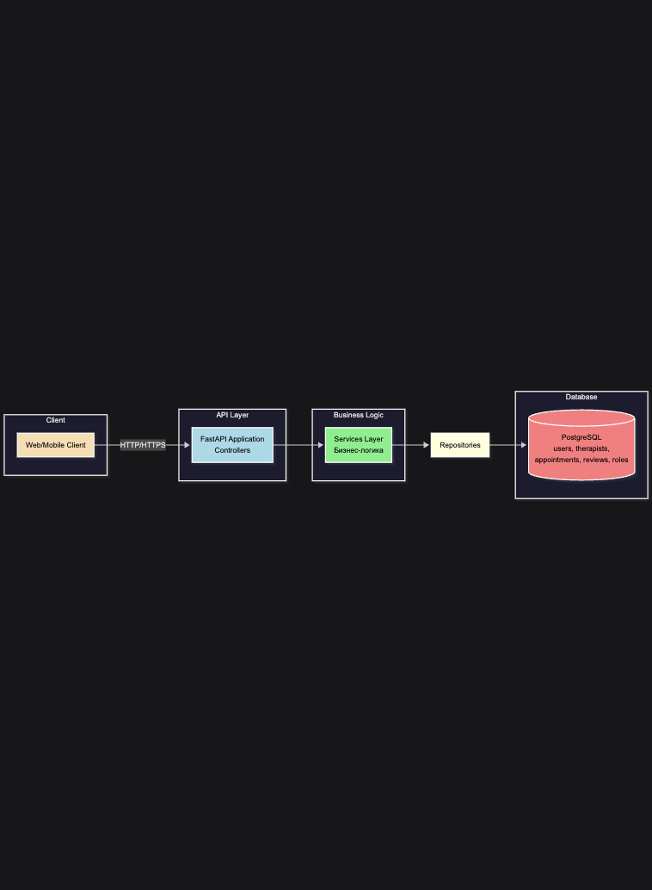

# Архитектура проекта

## Обзор

Веб-приложение для системы психологической поддержки студентов МосПолитеха на базе FastAPI и PostgreSQL.

## Диаграммы

### 1. Архитектура системы

Трехслойная архитектура:
- **API Layer**: FastAPI контроллеры
- **Business Logic**: Сервисы с бизнес-логикой
- **Data Access**: Репозитории для работы с БД



**Исходный файл**: [`architecture_diagram.mmd`](./architecture_diagram.mmd)

### 2. База данных (ERD)

Основные таблицы:
- **users** - пользователи системы
- **therapists** - профили психологов (1:1 с users)
- **appointments** - записи на приём
- **reviews** - отзывы о приёмах
- **roles** - роли пользователей (многие-ко-многим)


**Исходный файл**: [`database_erd.mmd`](./database_erd.mmd)

## Технологический стек

- **Backend**: FastAPI 0.115.0
- **Database**: PostgreSQL + SQLAlchemy 2.0.35 (async)
- **Auth**: PyJWT 2.9.0 + Passlib/Bcrypt
- **Validation**: Pydantic 2.0+
- **Deployment**: Docker + Docker Compose

## Структура проекта

```
psychohelp/
├── config/              # Конфигурация БД
├── models/              # SQLAlchemy модели
├── repositories/        # Доступ к данным (CRUD)
├── routes/controllers/  # HTTP контроллеры
├── schemas/             # Pydantic схемы валидации
├── services/            # Бизнес-логика
└── main.py              # Точка входа
```

## Безопасность

- JWT токены в HTTP-only cookies
- Bcrypt для хеширования паролей
- CORS настроен для фронтенда
- Валидация через Pydantic

## Как просмотреть диаграммы

### GitHub
Откройте `.mmd` файл — диаграмма отобразится автоматически

### Онлайн
1. Откройте [mermaid.live](https://mermaid.live/)
2. Скопируйте содержимое `.mmd` файла
3. Вставьте в редактор